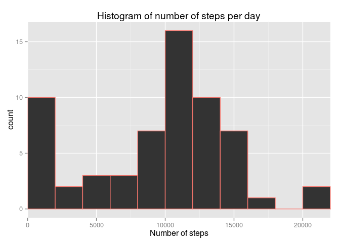
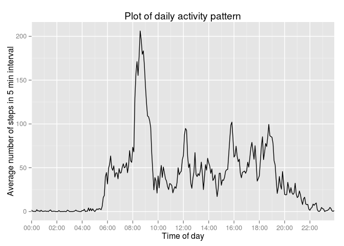
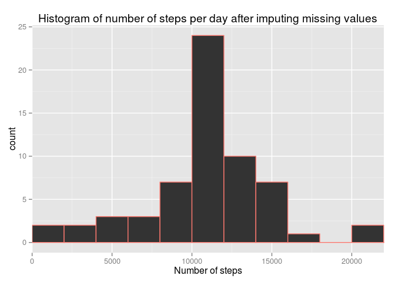
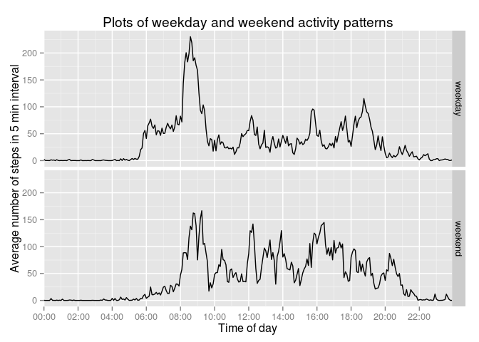

# Reproducible Research: Peer Assessment 1
Denis Kuzminykh  


## Loading and preprocessing the data

```r
if (!file.exists("activity.csv"))
  unzip("activity.zip")

activity <- transform(read.csv("activity.csv"), 
                      date = strptime(date, "%Y-%m-%d"), 
                      date_factor = factor(date))
```

## What is mean total number of steps taken per day?


```r
steps <- aggregate(activity$steps, by=list(date = factor(activity$date_factor)), sum, na.rm = TRUE)

fig1 <- qplot(steps$x, xlab = "Number of steps", col = "red", binwidth = 2000)
fig1 <- fig1 + ggtitle("Histogram of number of steps per day")
fig1 <- fig1 + theme(legend.position="none") + coord_cartesian(xlim = c(0, 22000))
fig1
```

 

Mean number of steps per day: 9354.23  
Median of number of steps per day: 10395

## What is the average daily activity pattern?

```r
daily_averages <- aggregate(activity$steps, by=list(interval = activity$interval), FUN=mean, na.rm = TRUE)
rownames(daily_averages) <- daily_averages$interval
# Converting intervals to datetime for plotting
daily_averages$interval <- sprintf("%04d", daily_averages$interval)
daily_averages$interval <- paste(substr(daily_averages$interval, 1, 2), 
                                 substr(daily_averages$interval, 3, 4), sep = ":")
daily_averages$interval <- strptime(daily_averages$interval, "%H:%M", tz = "UTC")

fig2 <- ggplot(data = daily_averages, aes(interval, x))
fig2 <- fig2 + ggtitle("Plot of daily activity pattern")
fig2 <- fig2 + geom_line() + xlab("Time of day") + ylab("Average number of steps in 5 min interval")
fig2 <- fig2 + scale_x_datetime(labels = date_format("%H:%M"), breaks = "2 hours")
fig2 <- fig2 + coord_cartesian(xlim = summary(daily_averages$interval)[c("Min.", "Max.")])
fig2
```

 

```r
max_activity_interval <- daily_averages[which.max(daily_averages$x), "interval"]
max_activity_interval <- strftime(max_activity_interval, format = "%H:%M")
```

Maximum 5 min activity interval: 08:35

## Imputing missing values

2304 values are missing

I will replace missing values by average numbers of steps for the time of day, rounded to integers.

```r
n <- rownames(daily_averages)
daily_averages <- daily_averages$x
names(daily_averages) <- n

intervals <- activity[is.na(activity$steps), "interval"]

activity2 <- activity
activity2[is.na(activity2$steps), "steps"] <- round(daily_averages[as.character(intervals)])

steps2 <- aggregate(activity2$steps, 
                    by=list(date = factor(activity2$date_factor)), 
                    FUN = sum, na.rm = TRUE)

fig3 <- qplot(steps2$x, xlab = "Number of steps", col = "red", binwidth = 2000)
fig3 <- fig3 + ggtitle("Histogram of number of steps per day after imputing missing values")
fig3 <- fig3 + theme(legend.position="none") + coord_cartesian(xlim = c(0, 22000))
fig3
```

 

Mean number of steps per day: 10765.64  
Median of number of steps per day: 10762

## Are there differences in activity patterns between weekdays and weekends?


```r
activity2$day_type <- as.factor(1+(weekdays(activity2$date) %in% c("Saturday", "Sunday")))
levels(activity2$day_type) <- c("weekday", "weekend")

daily_averages2 <- aggregate(activity2$steps, 
                             by=list(interval = activity2$interval, day_type = activity2$day_type), 
                             FUN=mean, na.rm = TRUE)
# Converting intervals to datetime for plotting
daily_averages2$interval <- sprintf("%04d", daily_averages2$interval)
daily_averages2$interval <- paste(substr(daily_averages2$interval, 1, 2), 
                                  substr(daily_averages2$interval, 3, 4), sep = ":")
daily_averages2$interval <- strptime(daily_averages2$interval, "%H:%M", tz = "UTC")

fig4 <- ggplot(data = daily_averages2, aes(interval, x))
fig4 <- fig4 + facet_grid(day_type ~ .)
fig4 <- fig4 + ggtitle("Plots of weekday and weekend activity patterns")
fig4 <- fig4 + geom_line() + xlab("Time of day") + ylab("Average number of steps in 5 min interval")
fig4 <- fig4 + scale_x_datetime(labels = date_format("%H:%M"), breaks = "2 hours")
fig4 <- fig4 + coord_cartesian(xlim = summary(daily_averages2$interval)[c("Min.", "Max.")])
fig4
```

 
